# HR-Workforce-Management

## 0. Main Mindmap

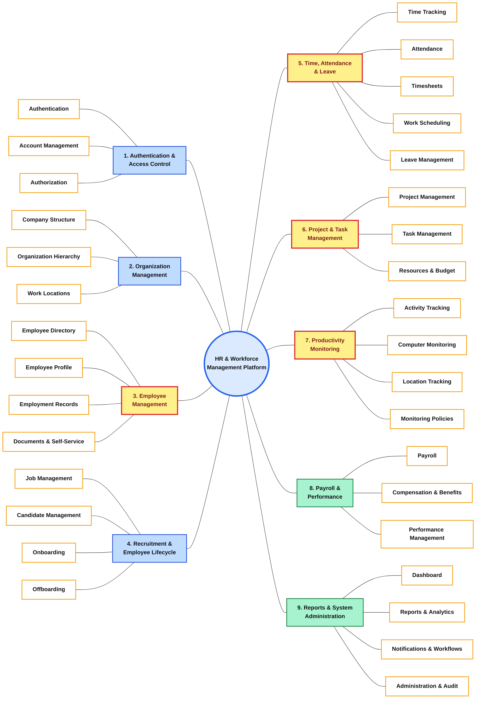

## 1. Authentication & Access Control

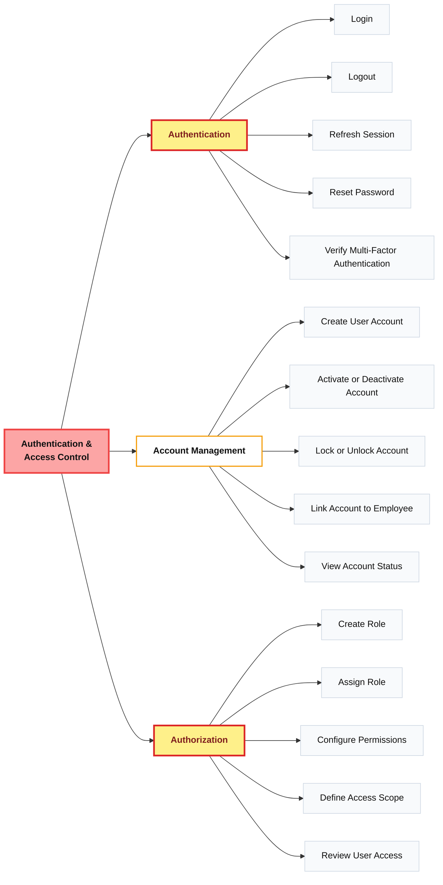

## 2. Organization Management

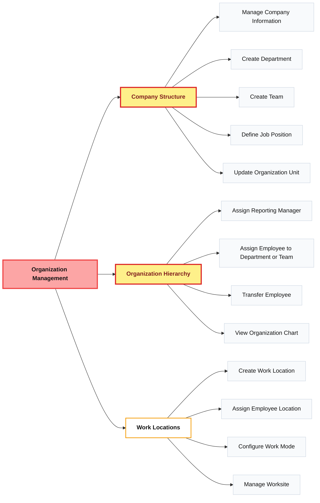

## 3. Employee Management

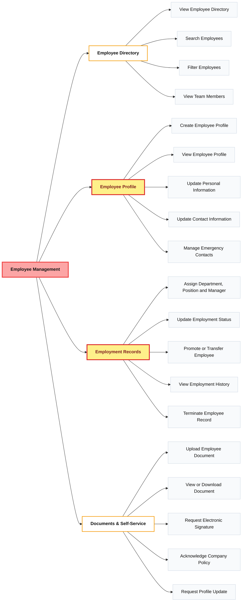

## 4. Recruitment & Employee Lifecycle

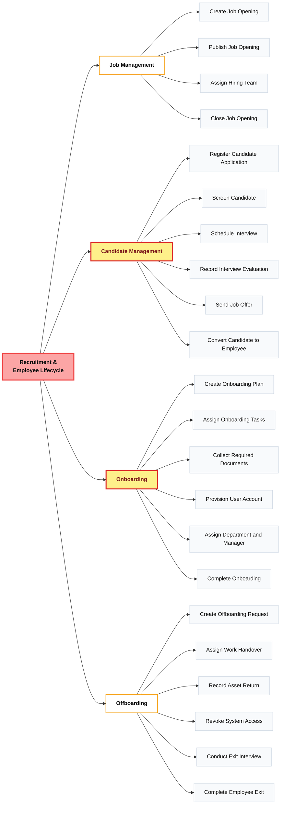

## 5. Time, Attendance & Leave

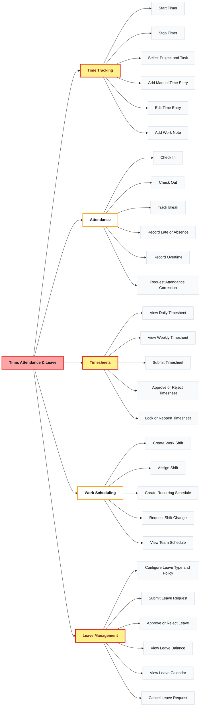

## 6. Project & Task Management

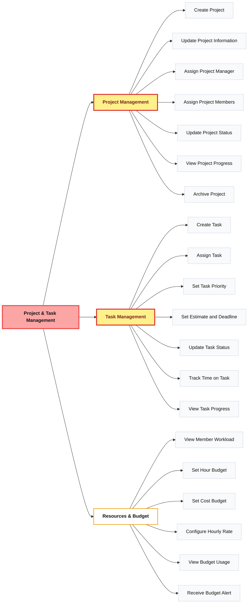

## 7. Productivity Monitoring

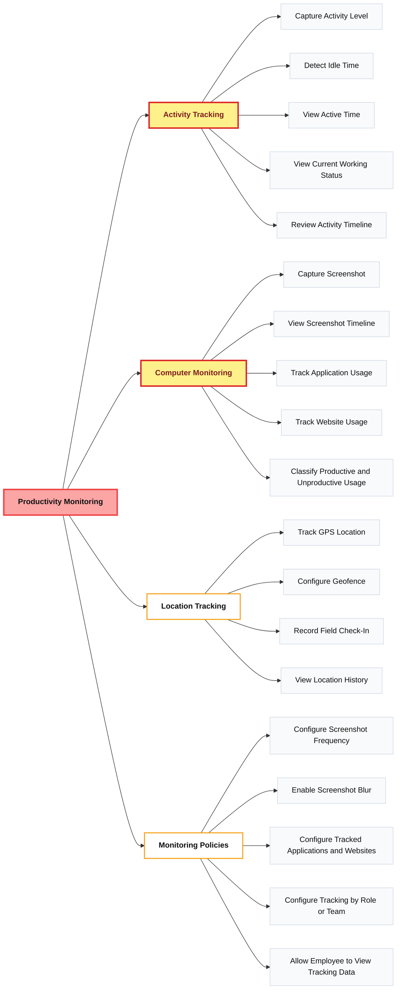

## 8. Payroll & Performance

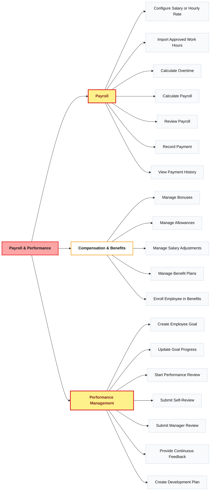

## 9. Reports & System Administration

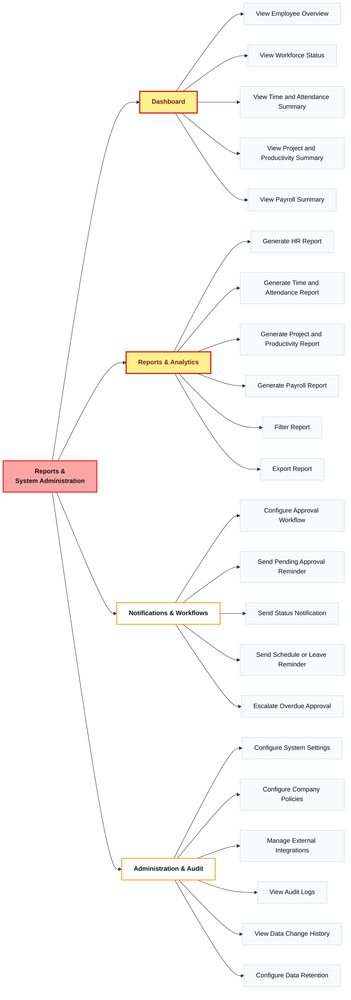

# System Actors and Roles

## 1. Overview

The **HR & Workforce Management Platform** includes eight main roles.

These roles cover recruitment, employee management, time tracking, project
management, productivity monitoring, payroll, and system administration.

| Role | Main Responsibility |
|---|---|
| Candidate | Participates in the recruitment process |
| Employee | Uses employee self-service and tracks daily work |
| Manager / Team Lead | Manages employees, approvals, and team performance |
| Project Manager | Manages projects, tasks, workloads, and budgets |
| HR Staff | Manages employee records and employee lifecycle |
| Recruiter | Manages job openings, candidates, interviews, and offers |
| Payroll Officer | Manages salaries, approved hours, and payroll |
| System Administrator | Manages accounts, permissions, policies, and system settings |

---

## 2. Candidate

A candidate is an external user who participates in the recruitment process
before becoming an employee.

### Main Functions

- View available job openings.
- Submit a job application.
- Create and update candidate information.
- Upload required application documents.
- View interview schedules.
- Participate in interviews.
- View and respond to a job offer.
- Submit onboarding documents after accepting an offer.

---

## 3. Employee

An employee is the primary internal user of the platform.

### Main Functions

- Log in and log out.
- Reset the account password.
- View and update personal information.
- Update contact and emergency contact information.
- View employee documents and company policies.
- Start and stop the work timer.
- Select a project and task before tracking time.
- Add or edit manual time entries.
- Check in and check out.
- Record breaks and overtime.
- Request an attendance correction.
- View daily and weekly timesheets.
- Submit a timesheet for approval.
- View assigned projects and tasks.
- Update task status.
- View work shifts and schedules.
- Submit or cancel a leave request.
- View leave balance and leave calendar.
- View personal productivity data.
- View performance goals and reviews.
- View salary and payment history.

---

## 4. Manager / Team Lead

A manager or team lead supervises employees within an assigned department,
team, or reporting structure.

A manager also has the normal functions of an employee.

### Main Functions

- View direct reports and team members.
- View employee profiles within the assigned access scope.
- Monitor team attendance and working status.
- View late arrivals, absences, breaks, and overtime.
- Approve or reject timesheets.
- Lock or reopen timesheets when authorized.
- Approve or reject leave requests.
- View the team leave calendar.
- Create and assign work shifts.
- View the team work schedule.
- Assign tasks to team members.
- Set task estimates and deadlines.
- Monitor tracked working hours.
- Monitor employee workload.
- View activity levels and idle time.
- View employee productivity information.
- Review employee goals.
- Submit manager performance reviews.
- Provide employee feedback.
- View team dashboards and reports.

---

## 5. Project Manager

A project manager is responsible for project execution, project members,
tasks, working hours, workloads, and budgets.

A project manager may also use the normal functions of an employee.

### Main Functions

- Create a project.
- Update project information.
- Assign project members.
- Remove members from a project.
- Update project status.
- Archive a completed project.
- Create and assign tasks.
- Set task priority.
- Set estimated hours.
- Set task deadlines.
- Monitor task status.
- Monitor tracked hours by project or task.
- View project progress.
- View member workload.
- Configure the project hour budget.
- Configure the project cost budget.
- View budget usage.
- Receive budget alerts.
- Generate project and productivity reports.

---

## 6. HR Staff

HR staff manage employee information, organization structure, employment
records, onboarding, offboarding, documents, and HR policies.

HR staff may also use the normal functions of an employee.

### Main Functions

- View, search, and filter the employee directory.
- Create an employee profile.
- Update employee information.
- Assign a department, team, position, manager, and work location.
- Update employee status.
- Promote or transfer an employee.
- View employment history.
- Terminate an employee record.
- Upload and manage employee documents.
- Request electronic signatures.
- Manage company information.
- Create and update departments.
- Create and update teams.
- Define job positions.
- Manage the organization hierarchy.
- View the organization chart.
- Manage branches, offices, and worksites.
- Configure remote or office work modes.
- Create an onboarding plan.
- Assign onboarding tasks.
- Collect required employee documents.
- Coordinate account creation.
- Complete employee onboarding.
- Create an offboarding request.
- Assign work handover activities.
- Record returned company assets.
- Coordinate access deactivation.
- Conduct an exit interview.
- Complete employee offboarding.
- Configure leave types and leave policies.
- Generate HR reports.

---

## 7. Recruiter

A recruiter is responsible for job openings and candidates throughout the
recruitment process.

The recruiter may be implemented as a specialized HR role.

### Main Functions

- Create a job opening.
- Update the job description.
- Publish a job opening.
- Close a job opening.
- Assign a hiring team.
- Register candidate applications.
- Create and update candidate profiles.
- Screen candidates.
- Update application status.
- Schedule interviews.
- Record interview evaluations.
- Send job offers.
- Track job offer status.
- Convert an accepted candidate into an employee.
- Start the onboarding process.

---

## 8. Payroll Officer

A payroll officer manages employee salaries, approved working hours,
compensation, benefits, payroll calculations, and payment records.

The payroll officer may also use the normal functions of an employee.

### Main Functions

- Configure employee salaries.
- Configure employee hourly rates.
- Retrieve approved working hours.
- Review regular working hours.
- Calculate overtime.
- Calculate payroll.
- Review payroll results.
- Record employee payments.
- View payment history.
- Manage bonuses.
- Manage allowances.
- Apply salary adjustments.
- Manage benefit plans.
- Enroll employees in benefits.
- Generate payroll reports.
- Export payroll data to an external payroll or payment system.

---

## 9. System Administrator

A system administrator manages platform accounts, roles, permissions,
monitoring policies, workflows, integrations, audit logs, and system
settings.

### Main Functions

- Create user accounts.
- Activate or deactivate accounts.
- Lock or unlock accounts.
- Link a user account to an employee profile.
- View account status.
- Create and update roles.
- Assign roles to users.
- Configure permissions.
- Define access scopes.
- Review user access.
- Configure authentication settings.
- Configure multi-factor authentication.
- Configure screenshot frequency.
- Enable screenshot blurring.
- Configure tracked applications and websites.
- Configure tracking by role or team.
- Configure approval workflows.
- Configure system settings.
- Configure company policies.
- Manage external integrations.
- View audit logs.
- View data change history.
- Configure data retention policies.

---

# Usecase

## Time, Attendance & Leave

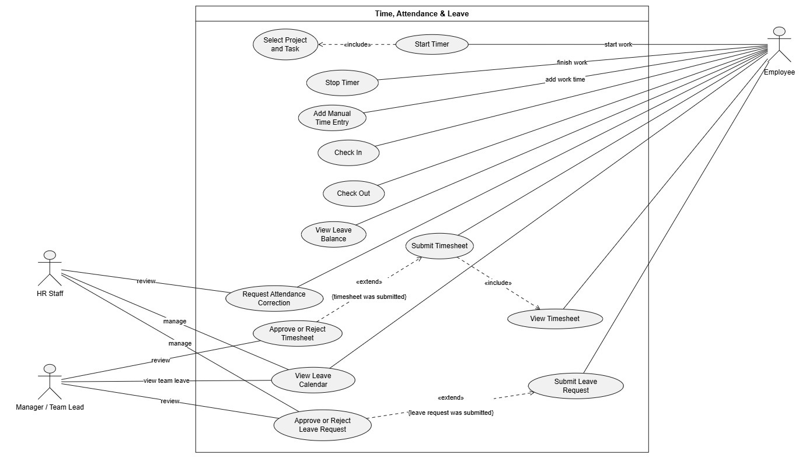