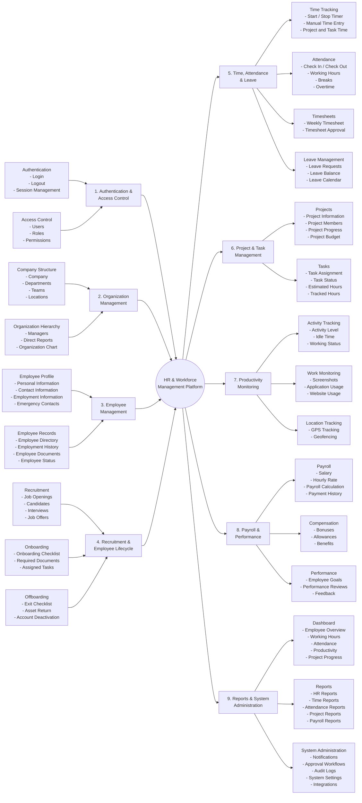

# HR-Workforce-Management

```mermaid
flowchart LR
    P((HR & Workforce<br/>Management Platform))

    %% =========================
    %% Left side modules
    %% =========================
    M1["1. Authentication &<br/>Access Control"] --> P
    M2["2. Organization<br/>Management"] --> P
    M3["3. Employee<br/>Management"] --> P
    M4["4. Recruitment &<br/>Employee Lifecycle"] --> P

    A11["Authentication<br/>- Login<br/>- Logout<br/>- Session Management"] --> M1
    A12["Access Control<br/>- Users<br/>- Roles<br/>- Permissions"] --> M1

    A21["Company Structure<br/>- Company<br/>- Departments<br/>- Teams<br/>- Locations"] --> M2
    A22["Organization Hierarchy<br/>- Managers<br/>- Direct Reports<br/>- Organization Chart"] --> M2

    A31["Employee Profile<br/>- Personal Information<br/>- Contact Information<br/>- Employment Information<br/>- Emergency Contacts"] --> M3
    A32["Employee Records<br/>- Employee Directory<br/>- Employment History<br/>- Employee Documents<br/>- Employee Status"] --> M3

    A41["Recruitment<br/>- Job Openings<br/>- Candidates<br/>- Interviews<br/>- Job Offers"] --> M4
    A42["Onboarding<br/>- Onboarding Checklist<br/>- Required Documents<br/>- Assigned Tasks"] --> M4
    A43["Offboarding<br/>- Exit Checklist<br/>- Asset Return<br/>- Account Deactivation"] --> M4

    %% =========================
    %% Right side modules
    %% =========================
    P --> M5["5. Time, Attendance<br/>& Leave"]
    P --> M6["6. Project & Task<br/>Management"]
    P --> M7["7. Productivity<br/>Monitoring"]
    P --> M8["8. Payroll &<br/>Performance"]
    P --> M9["9. Reports & System<br/>Administration"]

    M5 --> A51["Time Tracking<br/>- Start / Stop Timer<br/>- Manual Time Entry<br/>- Project and Task Time"]
    M5 --> A52["Attendance<br/>- Check In / Check Out<br/>- Working Hours<br/>- Breaks<br/>- Overtime"]
    M5 --> A53["Timesheets<br/>- Weekly Timesheet<br/>- Timesheet Approval"]
    M5 --> A54["Leave Management<br/>- Leave Requests<br/>- Leave Balance<br/>- Leave Calendar"]

    M6 --> A61["Projects<br/>- Project Information<br/>- Project Members<br/>- Project Progress<br/>- Project Budget"]
    M6 --> A62["Tasks<br/>- Task Assignment<br/>- Task Status<br/>- Estimated Hours<br/>- Tracked Hours"]

    M7 --> A71["Activity Tracking<br/>- Activity Level<br/>- Idle Time<br/>- Working Status"]
    M7 --> A72["Work Monitoring<br/>- Screenshots<br/>- Application Usage<br/>- Website Usage"]
    M7 --> A73["Location Tracking<br/>- GPS Tracking<br/>- Geofencing"]

    M8 --> A81["Payroll<br/>- Salary<br/>- Hourly Rate<br/>- Payroll Calculation<br/>- Payment History"]
    M8 --> A82["Compensation<br/>- Bonuses<br/>- Allowances<br/>- Benefits"]
    M8 --> A83["Performance<br/>- Employee Goals<br/>- Performance Reviews<br/>- Feedback"]

    M9 --> A91["Dashboard<br/>- Employee Overview<br/>- Working Hours<br/>- Attendance<br/>- Productivity<br/>- Project Progress"]
    M9 --> A92["Reports<br/>- HR Reports<br/>- Time Reports<br/>- Attendance Reports<br/>- Project Reports<br/>- Payroll Reports"]
    M9 --> A93["System Administration<br/>- Notifications<br/>- Approval Workflows<br/>- Audit Logs<br/>- System Settings<br/>- Integrations"]
```