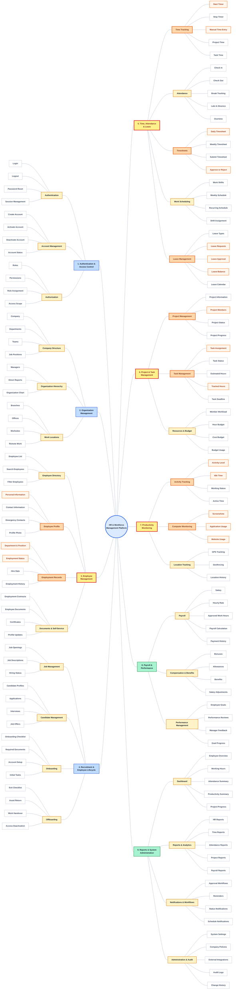

# HR-Workforce-Management

```mermaid
flowchart LR
    %% =====================================================
    %% ROOT
    %% =====================================================
    P(("HR & Workforce<br/>Management Platform"))

    %% =====================================================
    %% LAYER 1 — LEFT SIDE
    %% =====================================================
    M1["1. Authentication &<br/>Access Control"] --- P
    M2["2. Organization<br/>Management"] --- P
    M3["3. Employee<br/>Management"] --- P
    M4["4. Recruitment &<br/>Employee Lifecycle"] --- P

    %% =====================================================
    %% MODULE 1 — AUTHENTICATION & ACCESS CONTROL
    %% =====================================================
    A11["Authentication"] --- M1
    A12["Account Management"] --- M1
    A13["Authorization"] --- M1

    A111["Login"] --- A11
    A112["Logout"] --- A11
    A113["Password Reset"] --- A11
    A114["Session Management"] --- A11

    A121["Create Account"] --- A12
    A122["Activate Account"] --- A12
    A123["Deactivate Account"] --- A12
    A124["Account Status"] --- A12

    A131["Roles"] --- A13
    A132["Permissions"] --- A13
    A133["Role Assignment"] --- A13
    A134["Access Scope"] --- A13

    %% =====================================================
    %% MODULE 2 — ORGANIZATION MANAGEMENT
    %% =====================================================
    A21["Company Structure"] --- M2
    A22["Organization Hierarchy"] --- M2
    A23["Work Locations"] --- M2

    A211["Company"] --- A21
    A212["Departments"] --- A21
    A213["Teams"] --- A21
    A214["Job Positions"] --- A21

    A221["Managers"] --- A22
    A222["Direct Reports"] --- A22
    A223["Organization Chart"] --- A22

    A231["Branches"] --- A23
    A232["Offices"] --- A23
    A233["Worksites"] --- A23
    A234["Remote Work"] --- A23

    %% =====================================================
    %% MODULE 3 — EMPLOYEE MANAGEMENT
    %% =====================================================
    A31["Employee Directory"] --- M3
    A32["Employee Profile"] --- M3
    A33["Employment Records"] --- M3
    A34["Documents & Self-Service"] --- M3

    A311["Employee List"] --- A31
    A312["Search Employees"] --- A31
    A313["Filter Employees"] --- A31

    A321["Personal Information"] --- A32
    A322["Contact Information"] --- A32
    A323["Emergency Contacts"] --- A32
    A324["Profile Photo"] --- A32

    A331["Department & Position"] --- A33
    A332["Employment Status"] --- A33
    A333["Hire Date"] --- A33
    A334["Employment History"] --- A33

    A341["Employment Contracts"] --- A34
    A342["Employee Documents"] --- A34
    A343["Certificates"] --- A34
    A344["Profile Updates"] --- A34

    %% =====================================================
    %% MODULE 4 — RECRUITMENT & EMPLOYEE LIFECYCLE
    %% =====================================================
    A41["Job Management"] --- M4
    A42["Candidate Management"] --- M4
    A43["Onboarding"] --- M4
    A44["Offboarding"] --- M4

    A411["Job Openings"] --- A41
    A412["Job Descriptions"] --- A41
    A413["Hiring Status"] --- A41

    A421["Candidate Profiles"] --- A42
    A422["Applications"] --- A42
    A423["Interviews"] --- A42
    A424["Job Offers"] --- A42

    A431["Onboarding Checklist"] --- A43
    A432["Required Documents"] --- A43
    A433["Account Setup"] --- A43
    A434["Initial Tasks"] --- A43

    A441["Exit Checklist"] --- A44
    A442["Asset Return"] --- A44
    A443["Work Handover"] --- A44
    A444["Access Deactivation"] --- A44

    %% =====================================================
    %% LAYER 1 — RIGHT SIDE
    %% =====================================================
    P --- M5["5. Time, Attendance<br/>& Leave"]
    P --- M6["6. Project & Task<br/>Management"]
    P --- M7["7. Productivity<br/>Monitoring"]
    P --- M8["8. Payroll &<br/>Performance"]
    P --- M9["9. Reports & System<br/>Administration"]

    %% =====================================================
    %% MODULE 5 — TIME, ATTENDANCE & LEAVE
    %% =====================================================
    M5 --- A51["Time Tracking"]
    M5 --- A52["Attendance"]
    M5 --- A53["Timesheets"]
    M5 --- A54["Work Scheduling"]
    M5 --- A55["Leave Management"]

    A51 --- A511["Start Timer"]
    A51 --- A512["Stop Timer"]
    A51 --- A513["Manual Time Entry"]
    A51 --- A514["Project Time"]
    A51 --- A515["Task Time"]

    A52 --- A521["Check In"]
    A52 --- A522["Check Out"]
    A52 --- A523["Break Tracking"]
    A52 --- A524["Late & Absence"]
    A52 --- A525["Overtime"]

    A53 --- A531["Daily Timesheet"]
    A53 --- A532["Weekly Timesheet"]
    A53 --- A533["Submit Timesheet"]
    A53 --- A534["Approve or Reject"]

    A54 --- A541["Work Shifts"]
    A54 --- A542["Weekly Schedule"]
    A54 --- A543["Recurring Schedule"]
    A54 --- A544["Shift Assignment"]

    A55 --- A551["Leave Types"]
    A55 --- A552["Leave Requests"]
    A55 --- A553["Leave Approval"]
    A55 --- A554["Leave Balance"]
    A55 --- A555["Leave Calendar"]

    %% =====================================================
    %% MODULE 6 — PROJECT & TASK MANAGEMENT
    %% =====================================================
    M6 --- A61["Project Management"]
    M6 --- A62["Task Management"]
    M6 --- A63["Resources & Budget"]

    A61 --- A611["Project Information"]
    A61 --- A612["Project Members"]
    A61 --- A613["Project Status"]
    A61 --- A614["Project Progress"]

    A62 --- A621["Task Assignment"]
    A62 --- A622["Task Status"]
    A62 --- A623["Estimated Hours"]
    A62 --- A624["Tracked Hours"]
    A62 --- A625["Task Deadline"]

    A63 --- A631["Member Workload"]
    A63 --- A632["Hour Budget"]
    A63 --- A633["Cost Budget"]
    A63 --- A634["Budget Usage"]

    %% =====================================================
    %% MODULE 7 — PRODUCTIVITY MONITORING
    %% =====================================================
    M7 --- A71["Activity Tracking"]
    M7 --- A72["Computer Monitoring"]
    M7 --- A73["Location Tracking"]

    A71 --- A711["Activity Level"]
    A71 --- A712["Idle Time"]
    A71 --- A713["Working Status"]
    A71 --- A714["Active Time"]

    A72 --- A721["Screenshots"]
    A72 --- A722["Application Usage"]
    A72 --- A723["Website Usage"]

    A73 --- A731["GPS Tracking"]
    A73 --- A732["Geofencing"]
    A73 --- A733["Location History"]

    %% =====================================================
    %% MODULE 8 — PAYROLL & PERFORMANCE
    %% =====================================================
    M8 --- A81["Payroll"]
    M8 --- A82["Compensation & Benefits"]
    M8 --- A83["Performance Management"]

    A81 --- A811["Salary"]
    A81 --- A812["Hourly Rate"]
    A81 --- A813["Approved Work Hours"]
    A81 --- A814["Payroll Calculation"]
    A81 --- A815["Payment History"]

    A82 --- A821["Bonuses"]
    A82 --- A822["Allowances"]
    A82 --- A823["Benefits"]
    A82 --- A824["Salary Adjustments"]

    A83 --- A831["Employee Goals"]
    A83 --- A832["Performance Reviews"]
    A83 --- A833["Manager Feedback"]
    A83 --- A834["Goal Progress"]

    %% =====================================================
    %% MODULE 9 — REPORTS & SYSTEM ADMINISTRATION
    %% =====================================================
    M9 --- A91["Dashboard"]
    M9 --- A92["Reports & Analytics"]
    M9 --- A93["Notifications & Workflows"]
    M9 --- A94["Administration & Audit"]

    A91 --- A911["Employee Overview"]
    A91 --- A912["Working Hours"]
    A91 --- A913["Attendance Summary"]
    A91 --- A914["Productivity Summary"]
    A91 --- A915["Project Progress"]

    A92 --- A921["HR Reports"]
    A92 --- A922["Time Reports"]
    A92 --- A923["Attendance Reports"]
    A92 --- A924["Project Reports"]
    A92 --- A925["Payroll Reports"]

    A93 --- A931["Approval Workflows"]
    A93 --- A932["Reminders"]
    A93 --- A933["Status Notifications"]
    A93 --- A934["Schedule Notifications"]

    A94 --- A941["System Settings"]
    A94 --- A942["Company Policies"]
    A94 --- A943["External Integrations"]
    A94 --- A944["Audit Logs"]
    A94 --- A945["Change History"]

    %% =====================================================
    %% STYLES
    %% =====================================================

    %% Base styles — Mermaid requires classDef on one line
    classDef root fill:#dbeafe,stroke:#2563eb,stroke-width:4px,color:#111827,font-weight:bold;
    classDef layer1Left fill:#bfdbfe,stroke:#1d4ed8,stroke-width:2px,color:#111827,font-weight:bold;
    classDef layer1Right fill:#a7f3d0,stroke:#15803d,stroke-width:2px,color:#111827,font-weight:bold;
    classDef layer2 fill:#fef3c7,stroke:#d97706,stroke-width:2px,color:#111827,font-weight:bold;
    classDef layer3 fill:#ffffff,stroke:#94a3b8,stroke-width:1px,color:#334155;

    %% Highlight styles
    classDef criticalModule fill:#fef08a,stroke:#dc2626,stroke-width:4px,color:#7f1d1d,font-weight:bold;
    classDef criticalGroup fill:#fed7aa,stroke:#ea580c,stroke-width:3px,color:#7c2d12,font-weight:bold;
    classDef criticalFeature fill:#fff7ed,stroke:#f97316,stroke-width:2px,color:#9a3412,font-weight:bold;

    %% Root
    class P root;

    %% Layer 1 defaults
    class M1,M2,M3,M4 layer1Left;
    class M5,M6,M7,M8,M9 layer1Right;

    %% Layer 2 defaults
    class A11,A12,A13 layer2;
    class A21,A22,A23 layer2;
    class A31,A32,A33,A34 layer2;
    class A41,A42,A43,A44 layer2;
    class A51,A52,A53,A54,A55 layer2;
    class A61,A62,A63 layer2;
    class A71,A72,A73 layer2;
    class A81,A82,A83 layer2;
    class A91,A92,A93,A94 layer2;

    %% Layer 3 defaults
    class A111,A112,A113,A114,A121,A122,A123,A124,A131,A132,A133,A134 layer3;
    class A211,A212,A213,A214,A221,A222,A223,A231,A232,A233,A234 layer3;
    class A311,A312,A313,A321,A322,A323,A324,A331,A332,A333,A334,A341,A342,A343,A344 layer3;
    class A411,A412,A413,A421,A422,A423,A424,A431,A432,A433,A434,A441,A442,A443,A444 layer3;
    class A511,A512,A513,A514,A515,A521,A522,A523,A524,A525,A531,A532,A533,A534 layer3;
    class A541,A542,A543,A544,A551,A552,A553,A554,A555 layer3;
    class A611,A612,A613,A614,A621,A622,A623,A624,A625,A631,A632,A633,A634 layer3;
    class A711,A712,A713,A714,A721,A722,A723,A731,A732,A733 layer3;
    class A811,A812,A813,A814,A815,A821,A822,A823,A824,A831,A832,A833,A834 layer3;
    class A911,A912,A913,A914,A915,A921,A922,A923,A924,A925 layer3;
    class A931,A932,A933,A934,A941,A942,A943,A944,A945 layer3;

    %% Critical Layer 1 modules
    class M3,M5,M6,M7 criticalModule;

    %% Critical Layer 2 groups
    class A32,A33,A51,A53,A55,A61,A62,A71,A72 criticalGroup;

    %% Critical Layer 3 features
    class A321,A331,A332 criticalFeature;
    class A511,A513,A531,A534 criticalFeature;
    class A552,A553,A554 criticalFeature;
    class A612,A621,A624 criticalFeature;
    class A711,A712,A721,A722,A723 criticalFeature;

    %% Connections — must stay on one line
    linkStyle default stroke:#94a3b8,stroke-width:1.2px;
```