# HR-Workforce-Management

## 0. Main Mindmap

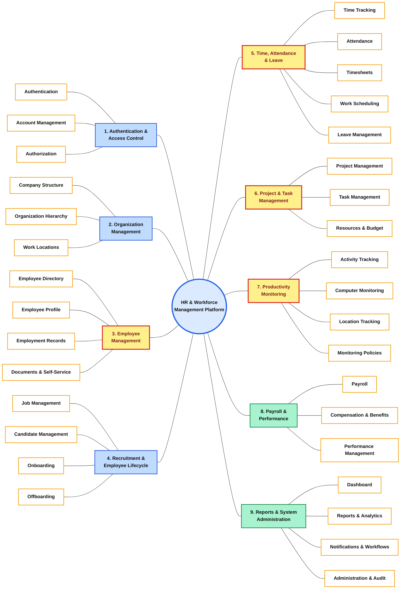
```mermaid
flowchart LR
    classDef root fill:#dbeafe,stroke:#2563eb,stroke-width:4px,color:#111,font-weight:bold;
    classDef leftModule fill:#bfdbfe,stroke:#1d4ed8,stroke-width:2px,color:#111,font-weight:bold;
    classDef rightModule fill:#a7f3d0,stroke:#15803d,stroke-width:2px,color:#111,font-weight:bold;
    classDef importantModule fill:#fef08a,stroke:#dc2626,stroke-width:3px,color:#7f1d1d,font-weight:bold;
    classDef feature fill:#ffffff,stroke:#f59e0b,stroke-width:2px,color:#111,font-weight:bold;

    P(("HR & Workforce<br/>Management Platform"))

    M1["1. Authentication &<br/>Access Control"] --- P
    M2["2. Organization<br/>Management"] --- P
    M3["3. Employee<br/>Management"] --- P
    M4["4. Recruitment &<br/>Employee Lifecycle"] --- P

    A11["Authentication"] --- M1
    A12["Account Management"] --- M1
    A13["Authorization"] --- M1

    A21["Company Structure"] --- M2
    A22["Organization Hierarchy"] --- M2
    A23["Work Locations"] --- M2

    A31["Employee Directory"] --- M3
    A32["Employee Profile"] --- M3
    A33["Employment Records"] --- M3
    A34["Documents & Self-Service"] --- M3

    A41["Job Management"] --- M4
    A42["Candidate Management"] --- M4
    A43["Onboarding"] --- M4
    A44["Offboarding"] --- M4

    P --- M5["5. Time, Attendance<br/>& Leave"]
    P --- M6["6. Project & Task<br/>Management"]
    P --- M7["7. Productivity<br/>Monitoring"]
    P --- M8["8. Payroll &<br/>Performance"]
    P --- M9["9. Reports & System<br/>Administration"]

    M5 --- A51["Time Tracking"]
    M5 --- A52["Attendance"]
    M5 --- A53["Timesheets"]
    M5 --- A54["Work Scheduling"]
    M5 --- A55["Leave Management"]

    M6 --- A61["Project Management"]
    M6 --- A62["Task Management"]
    M6 --- A63["Resources & Budget"]

    M7 --- A71["Activity Tracking"]
    M7 --- A72["Computer Monitoring"]
    M7 --- A73["Location Tracking"]
    M7 --- A74["Monitoring Policies"]

    M8 --- A81["Payroll"]
    M8 --- A82["Compensation & Benefits"]
    M8 --- A83["Performance Management"]

    M9 --- A91["Dashboard"]
    M9 --- A92["Reports & Analytics"]
    M9 --- A93["Notifications & Workflows"]
    M9 --- A94["Administration & Audit"]

    class P root;
    class M1,M2,M4 leftModule;
    class M8,M9 rightModule;
    class M3,M5,M6,M7 importantModule;
    class A11,A12,A13,A21,A22,A23,A31,A32,A33,A34,A41,A42,A43,A44 feature;
    class A51,A52,A53,A54,A55,A61,A62,A63,A71,A72,A73,A74,A81,A82,A83,A91,A92,A93,A94 feature;
```

---

## 1. Authentication & Access Control

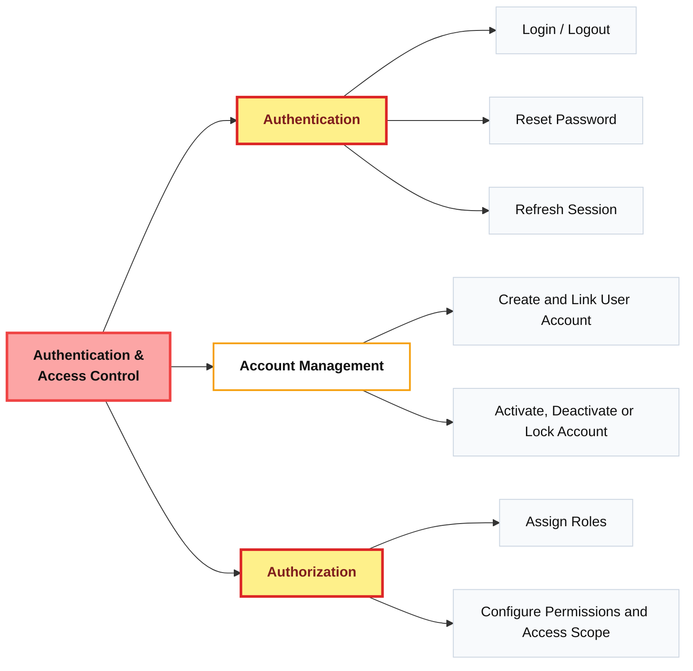
```mermaid
flowchart LR
    classDef module fill:#fca5a5,stroke:#ef4444,stroke-width:3px,color:#111,font-weight:bold;
    classDef feature fill:#ffffff,stroke:#f59e0b,stroke-width:2px,color:#111,font-weight:bold;
    classDef important fill:#fef08a,stroke:#dc2626,stroke-width:3px,color:#7f1d1d,font-weight:bold;
    classDef usecase fill:#f8fafc,stroke:#cbd5e1,color:#111;

    AUTH["Authentication &<br/>Access Control"]

    AUTH --> LOGIN["Authentication"]
    AUTH --> ACCOUNT["Account Management"]
    AUTH --> ACCESS["Authorization"]

    LOGIN --> L1["Login / Logout"]
    LOGIN --> L2["Reset Password"]
    LOGIN --> L3["Refresh Session"]

    ACCOUNT --> AC1["Create and Link User Account"]
    ACCOUNT --> AC2["Activate, Deactivate or Lock Account"]

    ACCESS --> AU1["Assign Roles"]
    ACCESS --> AU2["Configure Permissions and Access Scope"]

    class AUTH module;
    class LOGIN,ACCOUNT,ACCESS feature;
    class LOGIN,ACCESS important;
    class L1,L2,L3,AC1,AC2,AU1,AU2 usecase;
```

---

## 2. Organization Management

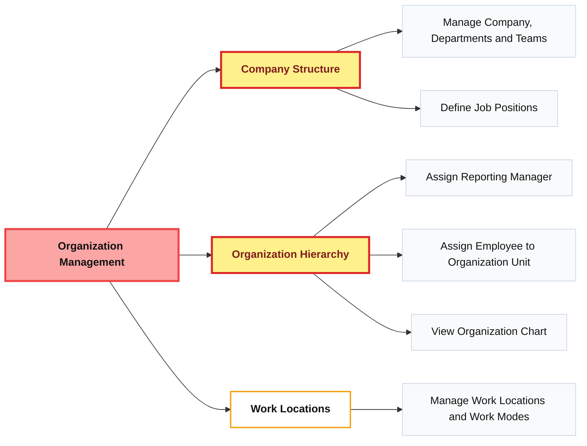
```mermaid
flowchart LR
    classDef module fill:#fca5a5,stroke:#ef4444,stroke-width:3px,color:#111,font-weight:bold;
    classDef feature fill:#ffffff,stroke:#f59e0b,stroke-width:2px,color:#111,font-weight:bold;
    classDef important fill:#fef08a,stroke:#dc2626,stroke-width:3px,color:#7f1d1d,font-weight:bold;
    classDef usecase fill:#f8fafc,stroke:#cbd5e1,color:#111;

    ORG["Organization Management"]

    ORG --> STRUCTURE["Company Structure"]
    ORG --> HIERARCHY["Organization Hierarchy"]
    ORG --> LOCATION["Work Locations"]

    STRUCTURE --> S1["Manage Company, Departments and Teams"]
    STRUCTURE --> S2["Define Job Positions"]

    HIERARCHY --> H1["Assign Reporting Manager"]
    HIERARCHY --> H2["Assign Employee to Organization Unit"]
    HIERARCHY --> H3["View Organization Chart"]

    LOCATION --> W1["Manage Work Locations and Work Modes"]

    class ORG module;
    class STRUCTURE,HIERARCHY,LOCATION feature;
    class STRUCTURE,HIERARCHY important;
    class S1,S2,H1,H2,H3,W1 usecase;
```

---

## 3. Employee Management

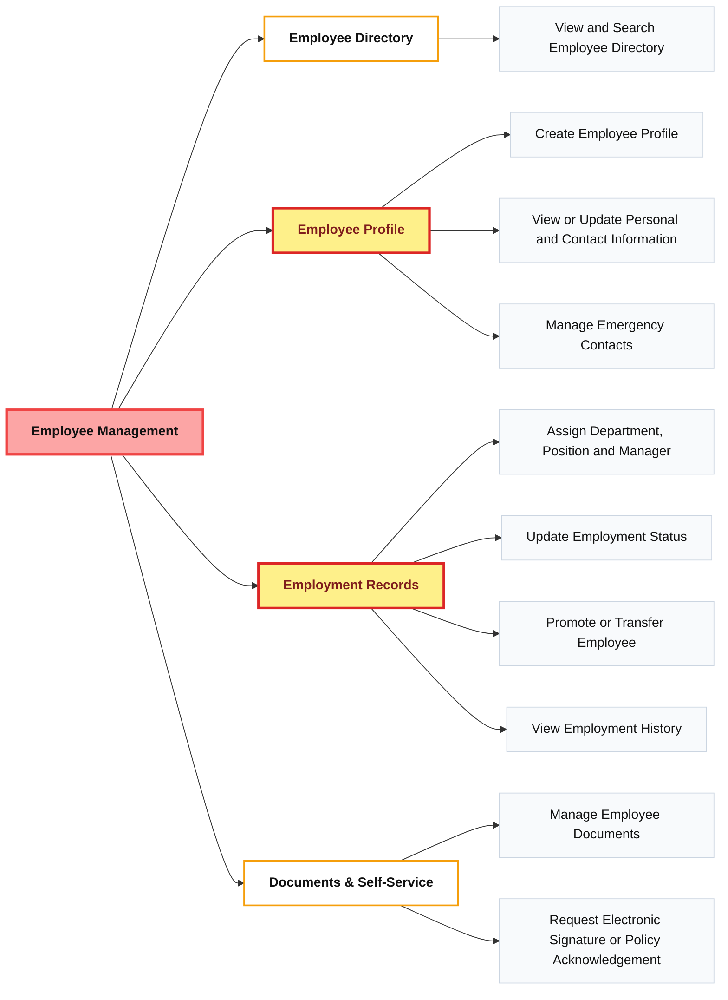
```mermaid
flowchart LR
    classDef module fill:#fca5a5,stroke:#ef4444,stroke-width:3px,color:#111,font-weight:bold;
    classDef feature fill:#ffffff,stroke:#f59e0b,stroke-width:2px,color:#111,font-weight:bold;
    classDef important fill:#fef08a,stroke:#dc2626,stroke-width:3px,color:#7f1d1d,font-weight:bold;
    classDef usecase fill:#f8fafc,stroke:#cbd5e1,color:#111;

    EMP["Employee Management"]

    EMP --> DIRECTORY["Employee Directory"]
    EMP --> PROFILE["Employee Profile"]
    EMP --> RECORDS["Employment Records"]
    EMP --> DOCUMENTS["Documents & Self-Service"]

    DIRECTORY --> D1["View and Search Employee Directory"]

    PROFILE --> P1["Create Employee Profile"]
    PROFILE --> P2["View or Update Personal and Contact Information"]
    PROFILE --> P3["Manage Emergency Contacts"]

    RECORDS --> R1["Assign Department, Position and Manager"]
    RECORDS --> R2["Update Employment Status"]
    RECORDS --> R3["Promote or Transfer Employee"]
    RECORDS --> R4["View Employment History"]

    DOCUMENTS --> DS1["Manage Employee Documents"]
    DOCUMENTS --> DS2["Request Electronic Signature or Policy Acknowledgement"]

    class EMP module;
    class DIRECTORY,PROFILE,RECORDS,DOCUMENTS feature;
    class PROFILE,RECORDS important;
    class D1,P1,P2,P3,R1,R2,R3,R4,DS1,DS2 usecase;
```

---

## 4. Recruitment & Employee Lifecycle

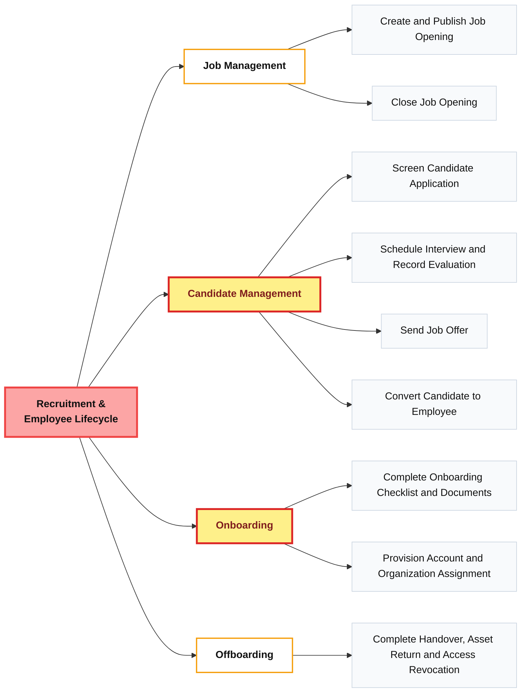
```mermaid
flowchart LR
    classDef module fill:#fca5a5,stroke:#ef4444,stroke-width:3px,color:#111,font-weight:bold;
    classDef feature fill:#ffffff,stroke:#f59e0b,stroke-width:2px,color:#111,font-weight:bold;
    classDef important fill:#fef08a,stroke:#dc2626,stroke-width:3px,color:#7f1d1d,font-weight:bold;
    classDef usecase fill:#f8fafc,stroke:#cbd5e1,color:#111;

    LIFE["Recruitment &<br/>Employee Lifecycle"]

    LIFE --> JOB["Job Management"]
    LIFE --> CANDIDATE["Candidate Management"]
    LIFE --> ONBOARDING["Onboarding"]
    LIFE --> OFFBOARDING["Offboarding"]

    JOB --> J1["Create and Publish Job Opening"]
    JOB --> J2["Close Job Opening"]

    CANDIDATE --> C1["Screen Candidate Application"]
    CANDIDATE --> C2["Schedule Interview and Record Evaluation"]
    CANDIDATE --> C3["Send Job Offer"]
    CANDIDATE --> C4["Convert Candidate to Employee"]

    ONBOARDING --> O1["Complete Onboarding Checklist and Documents"]
    ONBOARDING --> O2["Provision Account and Organization Assignment"]

    OFFBOARDING --> F1["Complete Handover, Asset Return and Access Revocation"]

    class LIFE module;
    class JOB,CANDIDATE,ONBOARDING,OFFBOARDING feature;
    class CANDIDATE,ONBOARDING important;
    class J1,J2,C1,C2,C3,C4,O1,O2,F1 usecase;
```

---

## 5. Time, Attendance & Leave

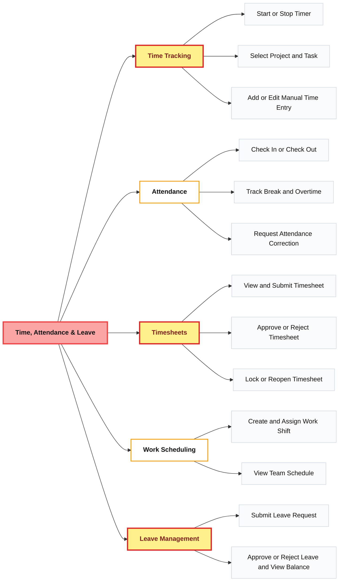
```mermaid
flowchart LR
    classDef module fill:#fca5a5,stroke:#ef4444,stroke-width:3px,color:#111,font-weight:bold;
    classDef feature fill:#ffffff,stroke:#f59e0b,stroke-width:2px,color:#111,font-weight:bold;
    classDef important fill:#fef08a,stroke:#dc2626,stroke-width:3px,color:#7f1d1d,font-weight:bold;
    classDef usecase fill:#f8fafc,stroke:#cbd5e1,color:#111;

    TIME["Time, Attendance & Leave"]

    TIME --> TRACKING["Time Tracking"]
    TIME --> ATTENDANCE["Attendance"]
    TIME --> TIMESHEET["Timesheets"]
    TIME --> SCHEDULE["Work Scheduling"]
    TIME --> LEAVE["Leave Management"]

    TRACKING --> T1["Start or Stop Timer"]
    TRACKING --> T2["Select Project and Task"]
    TRACKING --> T3["Add or Edit Manual Time Entry"]

    ATTENDANCE --> A1["Check In or Check Out"]
    ATTENDANCE --> A2["Track Break and Overtime"]
    ATTENDANCE --> A3["Request Attendance Correction"]

    TIMESHEET --> TS1["View and Submit Timesheet"]
    TIMESHEET --> TS2["Approve or Reject Timesheet"]
    TIMESHEET --> TS3["Lock or Reopen Timesheet"]

    SCHEDULE --> S1["Create and Assign Work Shift"]
    SCHEDULE --> S2["View Team Schedule"]

    LEAVE --> L1["Submit Leave Request"]
    LEAVE --> L2["Approve or Reject Leave and View Balance"]

    class TIME module;
    class TRACKING,ATTENDANCE,TIMESHEET,SCHEDULE,LEAVE feature;
    class TRACKING,TIMESHEET,LEAVE important;
    class T1,T2,T3,A1,A2,A3,TS1,TS2,TS3,S1,S2,L1,L2 usecase;
```

---

## 6. Project & Task Management

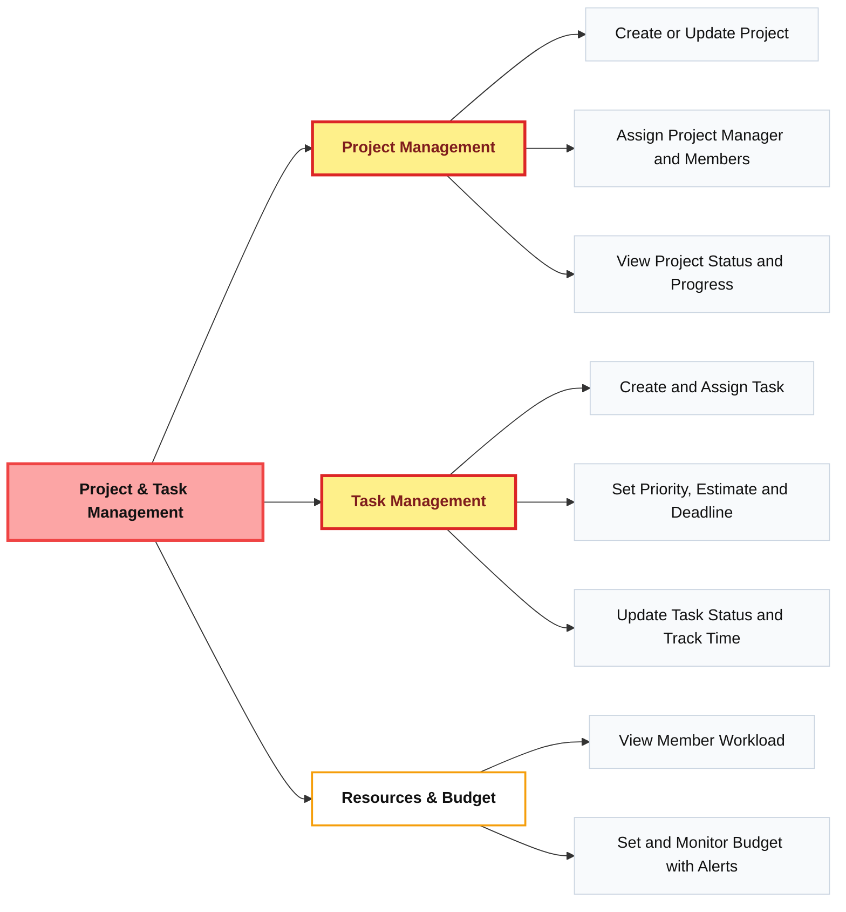
```mermaid
flowchart LR
    classDef module fill:#fca5a5,stroke:#ef4444,stroke-width:3px,color:#111,font-weight:bold;
    classDef feature fill:#ffffff,stroke:#f59e0b,stroke-width:2px,color:#111,font-weight:bold;
    classDef important fill:#fef08a,stroke:#dc2626,stroke-width:3px,color:#7f1d1d,font-weight:bold;
    classDef usecase fill:#f8fafc,stroke:#cbd5e1,color:#111;

    PROJECTS["Project & Task Management"]

    PROJECTS --> PROJECT["Project Management"]
    PROJECTS --> TASK["Task Management"]
    PROJECTS --> RESOURCE["Resources & Budget"]

    PROJECT --> P1["Create or Update Project"]
    PROJECT --> P2["Assign Project Manager and Members"]
    PROJECT --> P3["View Project Status and Progress"]

    TASK --> T1["Create and Assign Task"]
    TASK --> T2["Set Priority, Estimate and Deadline"]
    TASK --> T3["Update Task Status and Track Time"]

    RESOURCE --> R1["View Member Workload"]
    RESOURCE --> R2["Set and Monitor Budget with Alerts"]

    class PROJECTS module;
    class PROJECT,TASK,RESOURCE feature;
    class PROJECT,TASK important;
    class P1,P2,P3,T1,T2,T3,R1,R2 usecase;
```

---

## 7. Productivity Monitoring

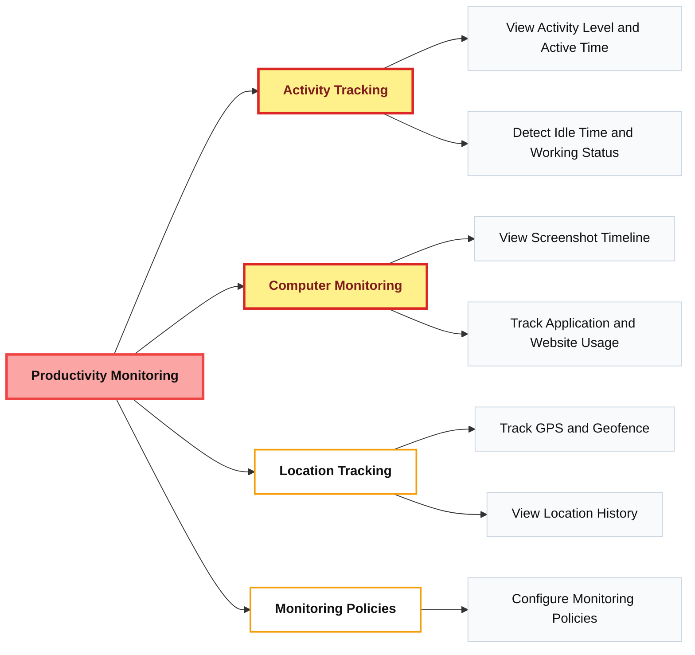
```mermaid
flowchart LR
    classDef module fill:#fca5a5,stroke:#ef4444,stroke-width:3px,color:#111,font-weight:bold;
    classDef feature fill:#ffffff,stroke:#f59e0b,stroke-width:2px,color:#111,font-weight:bold;
    classDef important fill:#fef08a,stroke:#dc2626,stroke-width:3px,color:#7f1d1d,font-weight:bold;
    classDef usecase fill:#f8fafc,stroke:#cbd5e1,color:#111;

    PRODUCTIVITY["Productivity Monitoring"]

    PRODUCTIVITY --> ACTIVITY["Activity Tracking"]
    PRODUCTIVITY --> COMPUTER["Computer Monitoring"]
    PRODUCTIVITY --> LOCATION["Location Tracking"]
    PRODUCTIVITY --> POLICY["Monitoring Policies"]

    ACTIVITY --> A1["View Activity Level and Active Time"]
    ACTIVITY --> A2["Detect Idle Time and Working Status"]

    COMPUTER --> C1["View Screenshot Timeline"]
    COMPUTER --> C2["Track Application and Website Usage"]

    LOCATION --> L1["Track GPS and Geofence"]
    LOCATION --> L2["View Location History"]

    POLICY --> P1["Configure Monitoring Policies"]

    class PRODUCTIVITY module;
    class ACTIVITY,COMPUTER,LOCATION,POLICY feature;
    class ACTIVITY,COMPUTER important;
    class A1,A2,C1,C2,L1,L2,P1 usecase;
```

---

## 8. Payroll & Performance

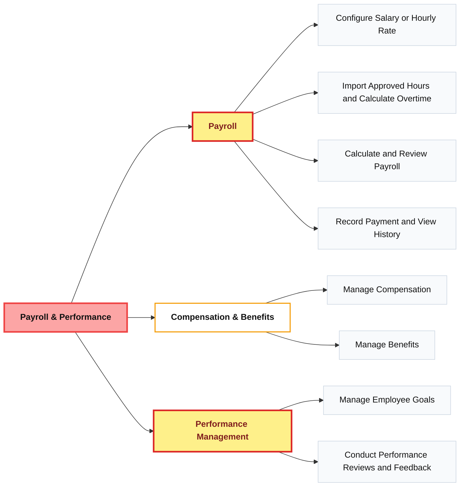
```mermaid
flowchart LR
    classDef module fill:#fca5a5,stroke:#ef4444,stroke-width:3px,color:#111,font-weight:bold;
    classDef feature fill:#ffffff,stroke:#f59e0b,stroke-width:2px,color:#111,font-weight:bold;
    classDef important fill:#fef08a,stroke:#dc2626,stroke-width:3px,color:#7f1d1d,font-weight:bold;
    classDef usecase fill:#f8fafc,stroke:#cbd5e1,color:#111;

    PAYPERF["Payroll & Performance"]

    PAYPERF --> PAYROLL["Payroll"]
    PAYPERF --> COMPENSATION["Compensation & Benefits"]
    PAYPERF --> PERFORMANCE["Performance Management"]

    PAYROLL --> P1["Configure Salary or Hourly Rate"]
    PAYROLL --> P2["Import Approved Hours and Calculate Overtime"]
    PAYROLL --> P3["Calculate and Review Payroll"]
    PAYROLL --> P4["Record Payment and View History"]

    COMPENSATION --> C1["Manage Compensation"]
    COMPENSATION --> C2["Manage Benefits"]

    PERFORMANCE --> F1["Manage Employee Goals"]
    PERFORMANCE --> F2["Conduct Performance Reviews and Feedback"]

    class PAYPERF module;
    class PAYROLL,COMPENSATION,PERFORMANCE feature;
    class PAYROLL,PERFORMANCE important;
    class P1,P2,P3,P4,C1,C2,F1,F2 usecase;
```

---

## 9. Reports & System Administration

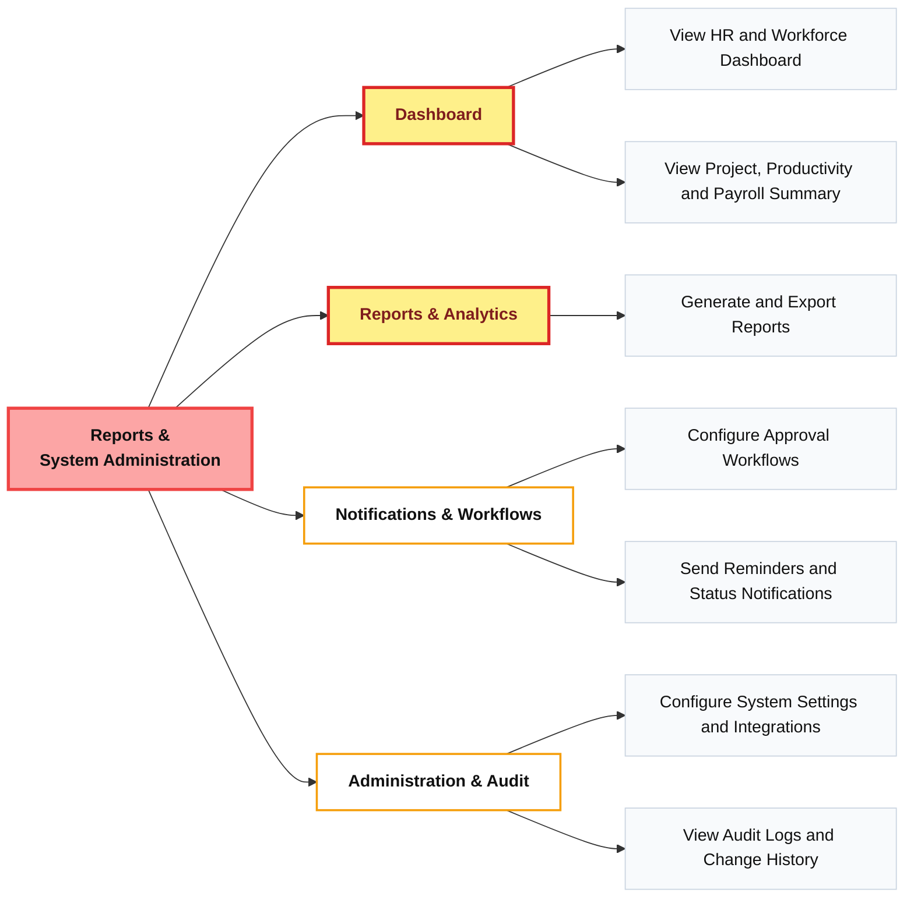
```mermaid
flowchart LR
    classDef module fill:#fca5a5,stroke:#ef4444,stroke-width:3px,color:#111,font-weight:bold;
    classDef feature fill:#ffffff,stroke:#f59e0b,stroke-width:2px,color:#111,font-weight:bold;
    classDef important fill:#fef08a,stroke:#dc2626,stroke-width:3px,color:#7f1d1d,font-weight:bold;
    classDef usecase fill:#f8fafc,stroke:#cbd5e1,color:#111;

    REPORTS["Reports &<br/>System Administration"]

    REPORTS --> DASHBOARD["Dashboard"]
    REPORTS --> ANALYTICS["Reports & Analytics"]
    REPORTS --> WORKFLOW["Notifications & Workflows"]
    REPORTS --> ADMIN["Administration & Audit"]

    DASHBOARD --> D1["View HR and Workforce Dashboard"]
    DASHBOARD --> D2["View Project, Productivity and Payroll Summary"]

    ANALYTICS --> A1["Generate and Export Reports"]

    WORKFLOW --> W1["Configure Approval Workflows"]
    WORKFLOW --> W2["Send Reminders and Status Notifications"]

    ADMIN --> AD1["Configure System Settings and Integrations"]
    ADMIN --> AD2["View Audit Logs and Change History"]

    class REPORTS module;
    class DASHBOARD,ANALYTICS,WORKFLOW,ADMIN feature;
    class DASHBOARD,ANALYTICS important;
    class D1,D2,A1,W1,W2,AD1,AD2 usecase;
```

---

# System Actors and Roles

## 1. Overview

The platform includes seven main roles. `Recruiter` is merged into `HR Staff` because recruitment is treated as a specialized HR responsibility.

| Role | Main Responsibility |
|---|---|
| Candidate | Participates in recruitment before becoming an employee |
| Employee | Uses self-service and performs daily workforce activities |
| Manager / Team Lead | Manages employees, attendance, approvals and team performance |
| Project Manager | Manages projects, tasks, resources and budgets |
| HR Staff & Recruiter | Manages organization data, employees, recruitment and employee lifecycle |
| Payroll Officer | Manages payroll, compensation and benefits |
| System Administrator | Manages accounts, permissions, policies, integrations and audits |

---

## 2. Candidate

- View job openings and submit an application.
- Update candidate information and application documents.
- View interview schedules and job-offer status.
- Accept an offer and submit onboarding information.

---

## 3. Employee

- View and update personal information.
- View employee documents and company policies.
- Track time by project and task.
- Check in, check out and submit attendance corrections.
- View and submit timesheets.
- View schedules and request leave.
- Update assigned task status.
- View personal productivity, goals and payment history.

---

## 4. Manager / Team Lead

A manager also has normal employee permissions within the permitted access scope.

- View direct reports and team workforce status.
- Approve timesheets, leave and attendance corrections.
- Create shifts and view the team schedule.
- Assign tasks and monitor workload.
- Review working hours, attendance and productivity.
- Review employee goals and provide performance feedback.
- View team dashboards and reports.

---

## 5. Project Manager

A project manager may also have normal employee permissions.

- Create and update projects.
- Assign project managers, members and tasks.
- Set task priorities, estimates and deadlines.
- Monitor task status and tracked hours.
- View project progress and member workload.
- Configure and monitor hour or cost budgets.
- Receive budget alerts and generate project reports.

---

## 6. HR Staff & Recruiter

HR Staff includes recruitment responsibilities instead of using a separate Recruiter role.

- Manage company structure, departments, teams, positions and locations.
- Create and maintain employee profiles and employment records.
- Manage employee documents and policy acknowledgements.
- Create and publish job openings.
- Screen candidates, schedule interviews and send offers.
- Convert accepted candidates into employees.
- Coordinate onboarding and offboarding.
- Configure leave policies and generate HR reports.

---

## 7. Payroll Officer

- Configure salary and hourly rates.
- Retrieve approved working hours and overtime.
- Calculate and review payroll.
- Record payments and view payment history.
- Manage compensation, allowances and benefits.
- Generate or export payroll reports.

---

## 8. System Administrator

- Create, activate, deactivate or lock user accounts.
- Assign roles and configure permissions or access scopes.
- Configure authentication and session settings.
- Configure productivity-monitoring policies.
- Configure approval workflows and system settings.
- Manage external integrations.
- Review audit logs and data-change history.

---

# HR & Workforce Management Platform — Use Case Catalogue

> Actor assignments are mapped from the role responsibilities defined in the system mindmap.  
> The catalogue contains **75 high-level use cases** across **9 modules**.

| No. | Use Case ID | Module | Feature Group | High-Level Use Case | Actors | Functional Description |
|---:|---|---|---|---|---|---|
| 1 | UC-AUTH-01 | Authentication & Access Control | Authentication | Login / Logout | Candidate; Employee; Manager / Team Lead; Project Manager; HR Staff & Recruiter; Payroll Officer; System Administrator | Authenticate users to access the platform and terminate their active sessions securely. |
| 2 | UC-AUTH-02 | Authentication & Access Control | Authentication | Reset Password | Candidate; Employee; Manager / Team Lead; Project Manager; HR Staff & Recruiter; Payroll Officer; System Administrator | Allow users to recover account access by verifying their identity and setting a new password. |
| 3 | UC-AUTH-03 | Authentication & Access Control | Authentication | Refresh Session | Candidate; Employee; Manager / Team Lead; Project Manager; HR Staff & Recruiter; Payroll Officer; System Administrator | Renew an authenticated session without requiring the user to log in again. |
| 4 | UC-AUTH-04 | Authentication & Access Control | Account Management | Create and Link User Account | HR Staff & Recruiter; System Administrator | Create a platform account and link it to the corresponding candidate or employee profile. |
| 5 | UC-AUTH-05 | Authentication & Access Control | Account Management | Activate, Deactivate or Lock Account | HR Staff & Recruiter; System Administrator | Control account status by activating, deactivating, locking, or restoring user access. |
| 6 | UC-AUTH-06 | Authentication & Access Control | Authorization | Assign Roles | System Administrator | Assign one or more system roles to a user according to their responsibilities. |
| 7 | UC-AUTH-07 | Authentication & Access Control | Authorization | Configure Permissions and Access Scope | System Administrator | Define permissions and restrict data access by organization, department, team, project, or employee scope. |
| 8 | UC-ORG-01 | Organization Management | Company Structure | Manage Company, Departments and Teams | HR Staff & Recruiter; System Administrator | Create and maintain company information, departments, teams, and organizational units. |
| 9 | UC-ORG-02 | Organization Management | Company Structure | Define Job Positions | HR Staff & Recruiter | Create and maintain job positions, job titles, and their organizational assignments. |
| 10 | UC-ORG-03 | Organization Management | Organization Hierarchy | Assign Reporting Manager | HR Staff & Recruiter | Assign or update the reporting manager responsible for an employee. |
| 11 | UC-ORG-04 | Organization Management | Organization Hierarchy | Assign Employee to Organization Unit | HR Staff & Recruiter | Assign an employee to a department, team, branch, or other organization unit. |
| 12 | UC-ORG-05 | Organization Management | Organization Hierarchy | View Organization Chart | Employee; Manager / Team Lead; Project Manager; HR Staff & Recruiter | Display the company hierarchy, reporting relationships, departments, teams, and positions. |
| 13 | UC-ORG-06 | Organization Management | Work Locations | Manage Work Locations and Work Modes | HR Staff & Recruiter; System Administrator | Create and maintain branches, offices, worksites, remote-work modes, and employee location assignments. |
| 14 | UC-EMP-01 | Employee Management | Employee Directory | View and Search Employee Directory | Employee; Manager / Team Lead; HR Staff & Recruiter | View, search, and filter employees according to the user's permitted access scope. |
| 15 | UC-EMP-02 | Employee Management | Employee Profile | Create Employee Profile | HR Staff & Recruiter | Create a new employee profile containing personal, contact, and employment information. |
| 16 | UC-EMP-03 | Employee Management | Employee Profile | View or Update Personal and Contact Information | Employee; HR Staff & Recruiter | View and update personal details, contact information, profile photo, and related employee data. |
| 17 | UC-EMP-04 | Employee Management | Employee Profile | Manage Emergency Contacts | Employee; HR Staff & Recruiter | Add, update, view, or remove emergency contact information for an employee. |
| 18 | UC-EMP-05 | Employee Management | Employment Records | Assign Department, Position and Manager | HR Staff & Recruiter | Assign an employee's department, job position, team, and reporting manager. |
| 19 | UC-EMP-06 | Employee Management | Employment Records | Update Employment Status | HR Staff & Recruiter | Update an employee's employment status, hire date, active state, or termination status. |
| 20 | UC-EMP-07 | Employee Management | Employment Records | Promote or Transfer Employee | Manager / Team Lead; HR Staff & Recruiter | Record an employee promotion or transfer and update the affected position, team, or reporting line. |
| 21 | UC-EMP-08 | Employee Management | Employment Records | View Employment History | Employee; Manager / Team Lead; HR Staff & Recruiter | View the employee's historical positions, departments, managers, statuses, promotions, and transfers. |
| 22 | UC-EMP-09 | Employee Management | Documents & Self-Service | Manage Employee Documents | Employee; HR Staff & Recruiter | Upload, view, download, update, and organize contracts, certificates, and other employee documents. |
| 23 | UC-EMP-10 | Employee Management | Documents & Self-Service | Request Electronic Signature or Policy Acknowledgement | Employee; HR Staff & Recruiter | Request and record an employee's electronic signature or acknowledgement of a company policy or document. |
| 24 | UC-REC-01 | Recruitment & Employee Lifecycle | Job Management | Create and Publish Job Opening | HR Staff & Recruiter | Create a job opening, define its description and requirements, and publish it for recruitment. |
| 25 | UC-REC-02 | Recruitment & Employee Lifecycle | Job Management | Close Job Opening | HR Staff & Recruiter | Close or archive a job opening when recruitment is completed, cancelled, or no longer active. |
| 26 | UC-REC-03 | Recruitment & Employee Lifecycle | Candidate Management | Screen Candidate Application | HR Staff & Recruiter | Review candidate profiles and applications and update their screening results or recruitment status. |
| 27 | UC-REC-04 | Recruitment & Employee Lifecycle | Candidate Management | Schedule Interview and Record Evaluation | Candidate; Manager / Team Lead; HR Staff & Recruiter | Schedule candidate interviews, assign interviewers, and record interview evaluations and outcomes. |
| 28 | UC-REC-05 | Recruitment & Employee Lifecycle | Candidate Management | Send Job Offer | Candidate; HR Staff & Recruiter | Create and send a job offer and record whether the candidate accepts, rejects, or requests changes. |
| 29 | UC-REC-06 | Recruitment & Employee Lifecycle | Candidate Management | Convert Candidate to Employee | HR Staff & Recruiter | Convert an accepted candidate into an employee and initialize the employee lifecycle process. |
| 30 | UC-REC-07 | Recruitment & Employee Lifecycle | Onboarding | Complete Onboarding Checklist and Documents | Candidate; Employee; Manager / Team Lead; HR Staff & Recruiter | Complete required onboarding tasks, collect documents, and track checklist completion. |
| 31 | UC-REC-08 | Recruitment & Employee Lifecycle | Onboarding | Provision Account and Organization Assignment | HR Staff & Recruiter; System Administrator | Provision the employee account and assign the employee to the correct department, team, position, and manager. |
| 32 | UC-REC-09 | Recruitment & Employee Lifecycle | Offboarding | Complete Handover, Asset Return and Access Revocation | Employee; Manager / Team Lead; HR Staff & Recruiter; System Administrator | Coordinate work handover, returned assets, exit activities, employee status updates, and system access revocation. |
| 33 | UC-TIME-01 | Time, Attendance & Leave | Time Tracking | Start or Stop Timer | Employee | Start or stop tracking working time for the selected project and task. |
| 34 | UC-TIME-02 | Time, Attendance & Leave | Time Tracking | Select Project and Task | Employee | Select the project and task to which tracked working time will be recorded. |
| 35 | UC-TIME-03 | Time, Attendance & Leave | Time Tracking | Add or Edit Manual Time Entry | Employee | Create or update a manual time entry when automatic timer data is unavailable or requires correction. |
| 36 | UC-TIME-04 | Time, Attendance & Leave | Attendance | Check In or Check Out | Employee | Record the employee's attendance start and end times for a working day or shift. |
| 37 | UC-TIME-05 | Time, Attendance & Leave | Attendance | Track Break and Overtime | Employee; Manager / Team Lead | Record employee break periods and overtime hours and make them available for managerial review. |
| 38 | UC-TIME-06 | Time, Attendance & Leave | Attendance | Request Attendance Correction | Employee; Manager / Team Lead; HR Staff & Recruiter | Submit, review, and resolve a request to correct an inaccurate attendance record. |
| 39 | UC-TIME-07 | Time, Attendance & Leave | Timesheets | View and Submit Timesheet | Employee | Review daily or weekly tracked time and submit the timesheet for approval. |
| 40 | UC-TIME-08 | Time, Attendance & Leave | Timesheets | Approve or Reject Timesheet | Manager / Team Lead; HR Staff & Recruiter | Review a submitted timesheet and approve or reject it with comments. |
| 41 | UC-TIME-09 | Time, Attendance & Leave | Timesheets | Lock or Reopen Timesheet | Manager / Team Lead; HR Staff & Recruiter | Lock an approved timesheet against further changes or reopen it when corrections are required. |
| 42 | UC-TIME-10 | Time, Attendance & Leave | Work Scheduling | Create and Assign Work Shift | Manager / Team Lead; HR Staff & Recruiter | Create work shifts or recurring schedules and assign them to employees or teams. |
| 43 | UC-TIME-11 | Time, Attendance & Leave | Work Scheduling | View Team Schedule | Employee; Manager / Team Lead; HR Staff & Recruiter | View employee and team work schedules, assigned shifts, and schedule changes. |
| 44 | UC-TIME-12 | Time, Attendance & Leave | Leave Management | Submit Leave Request | Employee | Create, update, cancel, and submit a leave request using an available leave type and balance. |
| 45 | UC-TIME-13 | Time, Attendance & Leave | Leave Management | Approve or Reject Leave and View Balance | Employee; Manager / Team Lead; HR Staff & Recruiter | Review leave balances and calendars and approve or reject submitted leave requests. |
| 46 | UC-PROJ-01 | Project & Task Management | Project Management | Create or Update Project | Manager / Team Lead; Project Manager | Create a project and maintain its information, status, dates, description, and ownership. |
| 47 | UC-PROJ-02 | Project & Task Management | Project Management | Assign Project Manager and Members | Manager / Team Lead; Project Manager | Assign the responsible project manager and add or remove project members. |
| 48 | UC-PROJ-03 | Project & Task Management | Project Management | View Project Status and Progress | Employee; Manager / Team Lead; Project Manager | View project status, completion progress, member participation, tasks, and tracked working hours. |
| 49 | UC-PROJ-04 | Project & Task Management | Task Management | Create and Assign Task | Manager / Team Lead; Project Manager | Create a project task and assign it to one or more project members. |
| 50 | UC-PROJ-05 | Project & Task Management | Task Management | Set Priority, Estimate and Deadline | Manager / Team Lead; Project Manager | Define task priority, estimated working hours, and completion deadline. |
| 51 | UC-PROJ-06 | Project & Task Management | Task Management | Update Task Status and Track Time | Employee; Manager / Team Lead; Project Manager | Update task progress or status and record the time spent completing the task. |
| 52 | UC-PROJ-07 | Project & Task Management | Resources & Budget | View Member Workload | Manager / Team Lead; Project Manager | View assigned tasks, estimated hours, tracked hours, and workload distribution for project members. |
| 53 | UC-PROJ-08 | Project & Task Management | Resources & Budget | Set and Monitor Budget with Alerts | Manager / Team Lead; Project Manager | Configure hour or cost budgets, monitor usage, and receive alerts when thresholds are reached. |
| 54 | UC-PROD-01 | Productivity Monitoring | Activity Tracking | View Activity Level and Active Time | Employee; Manager / Team Lead | View employee activity levels, active working time, and activity timeline within the permitted scope. |
| 55 | UC-PROD-02 | Productivity Monitoring | Activity Tracking | Detect Idle Time and Working Status | Employee; Manager / Team Lead | Detect idle periods and display whether an employee is active, idle, paused, or offline. |
| 56 | UC-PROD-03 | Productivity Monitoring | Computer Monitoring | View Screenshot Timeline | Employee; Manager / Team Lead | View screenshots captured during tracked work according to company monitoring policies. |
| 57 | UC-PROD-04 | Productivity Monitoring | Computer Monitoring | Track Application and Website Usage | Employee; Manager / Team Lead | Record and review applications and websites used while tracked work is active. |
| 58 | UC-PROD-05 | Productivity Monitoring | Location Tracking | Track GPS and Geofence | Employee; Manager / Team Lead; System Administrator | Record employee GPS locations and validate field attendance against configured geofences. |
| 59 | UC-PROD-06 | Productivity Monitoring | Location Tracking | View Location History | Employee; Manager / Team Lead; HR Staff & Recruiter | View historical employee locations and field check-ins according to authorized access scope. |
| 60 | UC-PROD-07 | Productivity Monitoring | Monitoring Policies | Configure Monitoring Policies | HR Staff & Recruiter; System Administrator | Configure screenshot, activity, application, website, location, privacy, and retention policies. |
| 61 | UC-PAY-01 | Payroll & Performance | Payroll | Configure Salary or Hourly Rate | HR Staff & Recruiter; Payroll Officer | Configure an employee's fixed salary, hourly rate, and effective compensation period. |
| 62 | UC-PAY-02 | Payroll & Performance | Payroll | Import Approved Hours and Calculate Overtime | Payroll Officer | Retrieve approved timesheet hours and calculate eligible overtime for the payroll period. |
| 63 | UC-PAY-03 | Payroll & Performance | Payroll | Calculate and Review Payroll | Payroll Officer | Calculate payroll from approved hours, salary, overtime, compensation, deductions, and adjustments, then review the result. |
| 64 | UC-PAY-04 | Payroll & Performance | Payroll | Record Payment and View History | Employee; Payroll Officer | Record employee payments and allow authorized users to view payroll and payment history. |
| 65 | UC-PAY-05 | Payroll & Performance | Compensation & Benefits | Manage Compensation | HR Staff & Recruiter; Payroll Officer | Manage bonuses, allowances, salary adjustments, and other compensation components. |
| 66 | UC-PAY-06 | Payroll & Performance | Compensation & Benefits | Manage Benefits | Employee; HR Staff & Recruiter; Payroll Officer | Create and maintain benefit plans and enroll eligible employees in selected benefits. |
| 67 | UC-PAY-07 | Payroll & Performance | Performance Management | Manage Employee Goals | Employee; Manager / Team Lead; HR Staff & Recruiter | Create employee goals, assign owners, update progress, and monitor goal completion. |
| 68 | UC-PAY-08 | Payroll & Performance | Performance Management | Conduct Performance Reviews and Feedback | Employee; Manager / Team Lead; HR Staff & Recruiter | Start review cycles, collect self-reviews and manager reviews, provide feedback, and record development actions. |
| 69 | UC-ADMIN-01 | Reports & System Administration | Dashboard | View HR and Workforce Dashboard | Manager / Team Lead; HR Staff & Recruiter; System Administrator | View employee, attendance, workforce-status, and other HR summary indicators. |
| 70 | UC-ADMIN-02 | Reports & System Administration | Dashboard | View Project, Productivity and Payroll Summary | Manager / Team Lead; Project Manager; HR Staff & Recruiter; Payroll Officer; System Administrator | View summarized project progress, productivity activity, working hours, and payroll indicators. |
| 71 | UC-ADMIN-03 | Reports & System Administration | Reports & Analytics | Generate and Export Reports | Manager / Team Lead; Project Manager; HR Staff & Recruiter; Payroll Officer; System Administrator | Generate, filter, and export HR, attendance, project, productivity, and payroll reports. |
| 72 | UC-ADMIN-04 | Reports & System Administration | Notifications & Workflows | Configure Approval Workflows | HR Staff & Recruiter; System Administrator | Configure approval steps, responsible approvers, escalation rules, and workflow conditions. |
| 73 | UC-ADMIN-05 | Reports & System Administration | Notifications & Workflows | Send Reminders and Status Notifications | HR Staff & Recruiter; System Administrator | Send reminders, approval notifications, schedule updates, leave updates, and other workflow status messages. |
| 74 | UC-ADMIN-06 | Reports & System Administration | Administration & Audit | Configure System Settings and Integrations | System Administrator | Configure platform settings, company policies, authentication options, and external system integrations. |
| 75 | UC-ADMIN-07 | Reports & System Administration | Administration & Audit | View Audit Logs and Change History | HR Staff & Recruiter; System Administrator | Review user actions, configuration changes, data updates, and historical audit records. |
---

# Usecase

## Time, Attendance & Leave

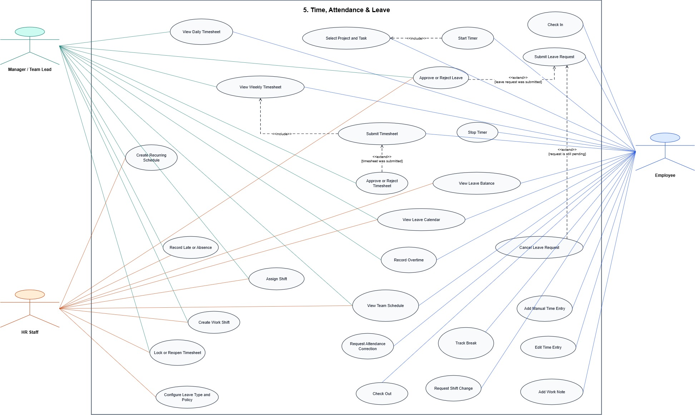

## Authentication and Controller Access

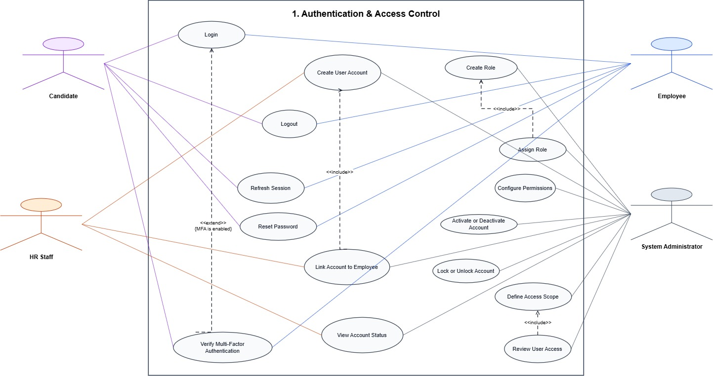

## Organization Management

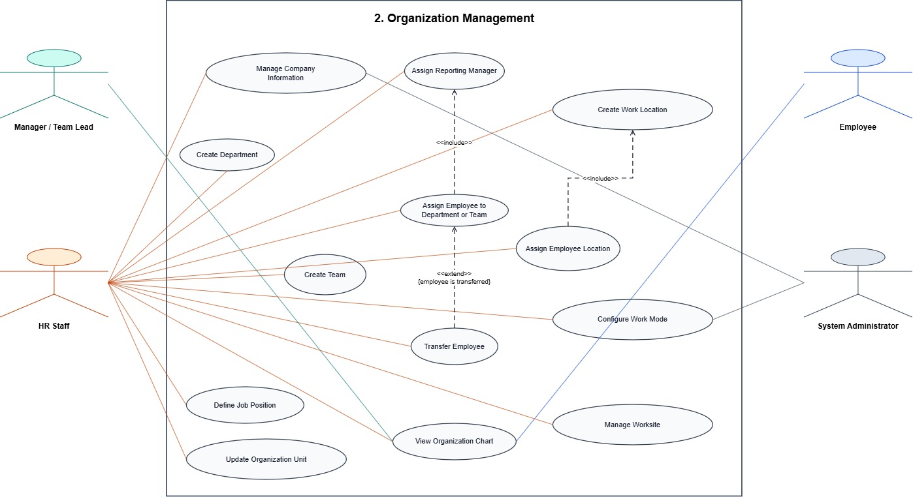

## Employee Management

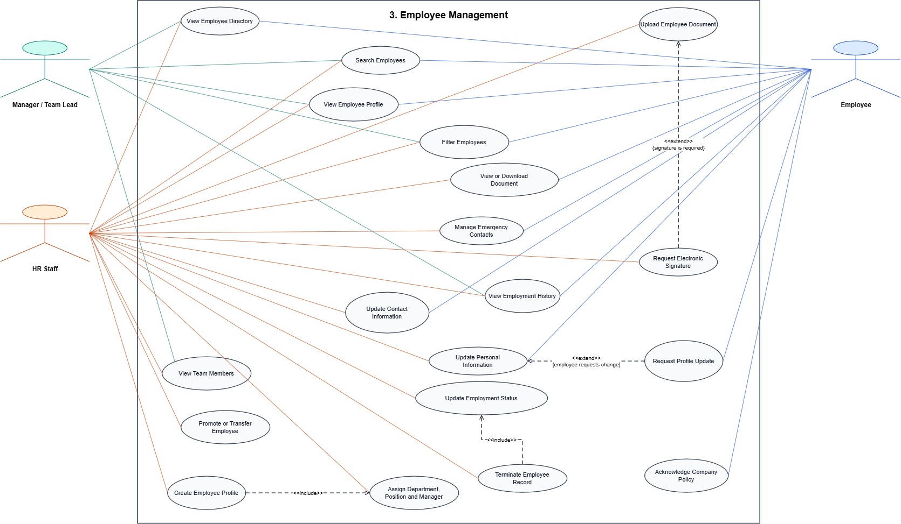

## Recruitment And Employee Lifecycle

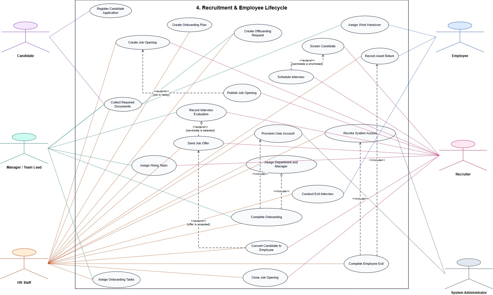

## Project Task Management

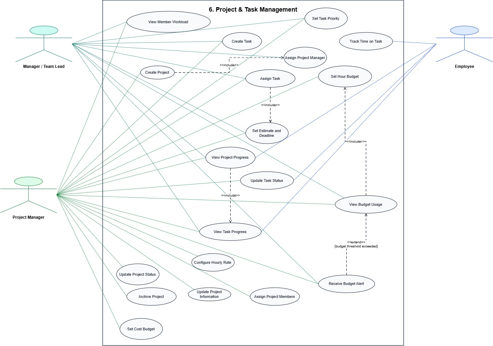

## Productivity Monitoring

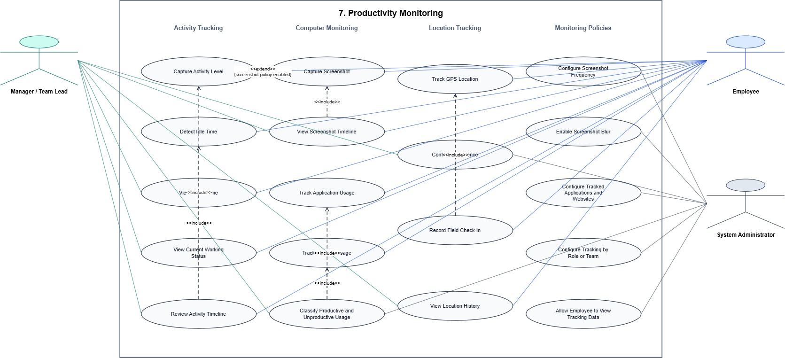

## Payroll & Performance

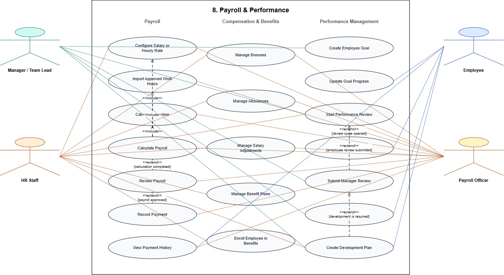

## Reports System Administration

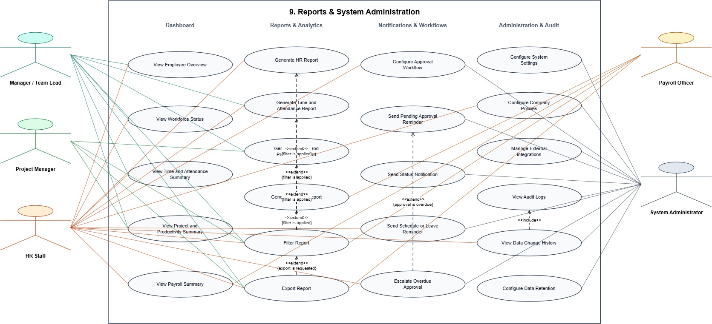